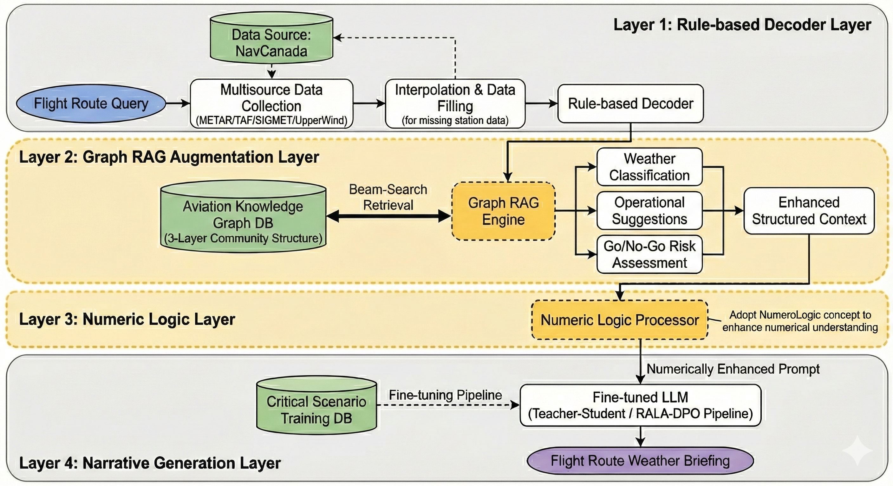

#

## Abstract

## Introduction
[Broad Context]
航空气象(Aviation Meteorology)是航空飞行中保障安全，提升效率的核心要素。如何处理各个飞行阶段接收到的气象信息，如何解读，归纳，并将之应用于决策，直接关系到航空运输系统的整体效能。传统的航空气象信息服务依赖于高度编码的字母数字格式(如METAR/SPEIC, TAF)以及碎片化的非结构化文本(如PIREP、NOTAM、Area Forecast Discussions). 这一类数据组织方式虽然在带宽受限的飞行通信系统中具有极高的传输效率，但也对飞行员的信息整合、解码以及即时决策能力有着较高的要求。随着现代航空气象观测技术的飞速发展，航空气象数据已从匮乏转向过载，这种“认知负担”已经成为制约决策效率的关键瓶颈。[Specific Focus]相比训练时间更长，飞行空域更加标准化的商业飞行员，通用航空飞行员(General Aviation Pilot)的飞行空域更加不可预测(多在非管制空域(Airspace Classs G))，缺乏缜密的交通管制(ATC), 对智能化的信息整理、辅助决策系统有着更迫切的需求. 
[The Problem]
近年来，以Transformer架构为基础的大语言模型(Large Language Models, LLMs)兴起, 为构建这样一个智能系统提供了坚实基础。然而, Decoder-only模型虽然有着强大的泛化能力，却有几个不可忽视的缺陷:
1. 在高度垂直的专业领域，受限于pre-training数据的匮乏, 有着严重的幻觉风险.
2. 由于Token机制的限制, 对于数字信息的处理不够敏感.
3. 具有较强因果推理能力(Reasoning)的模型往往参数量大, 昂贵且无法本地部署, 在飞行驾驶环境中无法应用.
[Research Objective]
针对上述问题, 我们以8B参数的本地模型为核心引擎, 搭建了一个航空气象信息整理、分析、转译的智能化系统. 这一系统以给定航路上的航空气象信息(METAR, TAF, SIGMET)为输入, 以决策导向的, 信息层级明确的航路气象报告为输出. 报告完全应用自然语言, 同时适用于文字显示和语音播报. 它集成了一个Graph RAG, 为智能体(Agent)提供精确的领域专业知识; 并应用Numeric Logic Tokenizer方法, 通过预处理和架构诱导(Inductive Bias Injection), 增强了模型的数字处理能力. 同时, 我们用教师模型挖掘, 生成的数据, 应用RALA-DPO(Retrieval-Augmented LLM Alignment via Direct Preference Optimization)方法, 对8B参数的学生模型进行了微调, 增强其领域相关的推理能力, 提高了模型针对关键情形(如曾经引起意外的天气现象)的推理准确性. 
[Contributions]
我们的主要贡献总结如下:
1. 搜集整理通用航空领域公开的关键资料(航空天气报告标准, 操作手册, 等等...), 构建了一个拥有三层社区结构(Community)的知识图谱数据库(Knowledge Graph Database), 并实现了Beam-Search等搜索方法.
2. 学习Numeric Logic Tokenizer的理念, 结合航空气象领域的数字特点, 设计了一套行之有效的数据预处理方案.
3. 搭建了一个完整的、可迁移的教师-学生模型微调管线(pipeline).
4. 从NTSB和NWS-AFD等公开数据库中, 挖掘并建立了一个包含关键(critical)气象情景的开源训练数据库, 方便后续研究.
[Thesis Outline]
本文的后续章节如下: 第二章综述了LLMs在航空气象处理领域的相关应用与发展现状; 第三章详细阐述了系统的总体架构及层级设计, 并介绍了模型微调管线; 第四章展示了微调数据库, Metrics选择以及Evaluation方法设计, baseline结果, 并与我们取得的成果进行了对比; 最后, 第五章对我们的研究做了总结, 并展望了未来的改进方向. 这种离散化的处理模式会使模型在面对未见过的数值(Out-of-Distribution)时产生预测偏差. 为了解决这一问题, xVal

## Related Work
为了解决大模型在专业领域的幻觉问题, Patrick Lewis等人(META)所提出的Retrieval-Augmented Generation系统被广泛应用. 如AviationGPT就将它应用在了航空领域. 通过将大量专业资料进行切分、向量化, 模型能够通过相似度检索与输入有关的资料, 丰富背景知识. 在RAG的基础上, Darren Edge等人(MicroSoft)提出了GraphRAG, 进一步增强了模型对领域知识的全局(Gloabl)把我, 并为Beam-search等以Graph为基础的检索算法的应用提供了可能性.
除了检索增强, 领域知识注入也是幻觉问题重要解决方案. 但对于大模型来说, 全参数微调往往昂贵且效率低下. Lora方法为低成本、高效率微调打下了坚实的基础, 而QLoRA则进一步降低了微调成本. AviationGPT同样应用了模型微调技术. 他们收集了海量的航空领域非标签文本(Unlabeled Aviation Text), 包括事故报告, 技术手册, 气象通报等, 通过在这些数据上进行自监督学习, 将模型能力迁移至航空语境. 在此基础上, 他们还通过构建好的"指令-回复"对, 对模型进行了有监督微调(SFT),使得模型能够理解特定的任务指令. 值得注意的是, 直接用航空领域高度编码压缩的数据对模型进行微调, 并没有最大程度上利用模型从海量自然语言中学习到的泛化能力.
数值准确性是生成式大模型在处理安全相关数据时面临的一个重大挑战, 在航空领域尤其如此. 在标准的Transformer架构中, 分词器(Tokenizer)会将数值切分为无意义的碎片. xVal试图通过引入一种新的数值编码方案, 直接将数值作为连续变量注入模型的嵌入层(Embedding Layer). 然而, 尽管这种方式十分优雅, 但它更适用于绝对位置编码的架构, 现有大模型往往使用ROPE等相对位置编码, 为直接应用这一方案增加了挑战. 与此同时, NumeroLogic提出了一种非侵入式的, 更通用的解决方案: 只对输入文本进行预处理, 通过特殊的数值格式诱导模型, 增强其对数值的位数、量级的理解能力, 起到类似Chain-of-thought的效果.
在以上研究的基础上, 我们在系统中增加了一个Rule-based Decoder layer, 将高度编码的航空气象信息解码为一般语言模型可以理解的语言块(Chunk), 并应用Graph RAG将气象信息按严重程度分类, 同时给出相应操作建议, 生成一个结构化的, 经过NumeroLogic预处理的中间报告, 以此报告为模型输入, 通过循环自监督学习和RALA-DPO微调, 最终生成符合航空标准的航路天气简报.

## Methodology
我们的系统架构如下: 
### Architecture

### Rule Based Decoder Layer
依据Avation Weather Handbook Chapter 24给出的规则, 我们用Regex 模式匹配构建了一个天气信息解析层, 首先将飞行途中遇到的所有相关机场和气象台(Aerodrome)(包括起飞和降落时的备降机场)的METAR(起飞站点)和TAF(降落站点)信息收集起来, 同时将途径站点(Enroute)发送的UpperWind信息也收集起来, 按照飞行时间排序, 形成初步报告.
对于没有METAR/TAF信息的基础, 则应用以下插值算法对邻居站点的信息进行插值, 形成有效气象信息:

### Graph RAG Layer
我们应用llama_index框架, 搜集多个航空领域公开资料, 构建了一个拥有三级社区结构的Graph RAG系统, 详述如下:
#### Matrial Sources
我们搜集了航空气象领域公开的15个资料, 包括 Meteorological Service for International Air Navigation 标准, 和 FAA 的 Aviation Weather Handbook, 详情见表2.
#### Entity and Relationship Design
#### Community Build
#### Query Methods
#### Assess Method

### Numeric Logic Layer

### Finetune
我们在Unsloth框架下, 应用QLoRA算法, 对基准模型进行了多阶段微调:
#### 循环自监督学习
由于航路气象自然语言报告数据的匮乏, 在微调的第一阶段, 我们采用了循环自监督学习策略, 首先让模型根据输入的结构化气象报告输出自然语言叙述, 然后依据这一输出反向构建结构化气象报告, 对比两个结构化报告的Mean Square Error, 逐步提高模型对航空气象信息的理解能力.

#### Retrieval-Augmented LLM Alignment Direct Preference Optimization
给定Graph RAG提供的Context信息, 模型的Classify及操作相关建议推理能力对于我们的系统来说也至关重要. 因此, 我们依据NTSB数据库中的事故数据, 以Gemini3 作为教师模型, 生成了1000个RALA-DPO数据对, 并从中人工筛选、检验了100对作为验证集, 应用DPO方法对模型进行了进一步微调.

#### 历史事故数据驱动的监督学习
在RALA-DPO微调之后, 我们混合大参数模型生成的合成数据(Gemini 3)与依据NTSB数据库中挖掘到的气象相关事故叙述(Narrative)反向生成的结构化气象报告(200条, LLM辅助的人工生成), 对模型进行进一步微调. 为了提高模型对Critical情景的理解能力, 我们对事故相关数据进行了Oversample.

## Experiment
我们结合合成数据和真实事故样本, 在基准模型及微调模型上进行了多次试验, 详述如下:
### Database
#### 合成数据
我们收集了加拿大210个航空气象站三个月以来的历史气象数据, 并在此基础上, 调用Gemini 3 API, 将1000条经过Graph RAG 增强的数据作为输入, 以Avation Weather Handbook Chapter 3.3.1.1为基础构建Prompt, 产生对应航路的气象报告, 用于小参数模型(8B)的微调.
#### 航空气象事故数据库
应用Graph RAG和Gemini3 API, 从NTSB数据库中, 挑选出200条与气象高度相关的事故信息, 反向构建航路气象数据表, 并在经过Graph RAG增强后, 与原本的事故Narrative结合构造完整的数据点, 形成黄金标准数据库, 并在微调时对这个数据库进行oversample, 增强模型在面对严苛气象情况时准确度.

### Metrics
在航空气象信息分析及航路气象报告生成领域, 传统的大模型评估指标如BLEU(仅衡量生成文本与参考文本的n-gram重合度), ROUGE(侧重于召回率, 常用于摘要)并不适用, 为了准确地评估这一智能系统的准确度和稳定性性, 我们使用了以下指标(Metric).
1. FactScore. 将模型生成的气象报告分解为原子事实(如风速, 温度, 降雨etc), 与原始报文中原子事实进行对比.
$$
    FactScore = \frac{Proved Facts}{Total Facts}\times100\%
$$
原子事实必须不可再分, 并且具有独立性, 不需要上下文就能理解.
2. Graph RAG 增强层的分类(Classify)准确率
针对增强层的中间报告, 逐站点计算其分类的准确率. 评估过程中, 可以输出通过输出Graph RAG context信息直接查询原始文档, 提升评估效率.
3. Go, No-Go二分类准确率
依据建立的航空气象事故数据库, 检测模型最终给出的决策建议的准确性.

### Baseline Model
我们选择Qwen 3 8B 模型作为基准模型, 并用航空气象事故数据库上评估其能力.
### Finetune Curve

### Result Comparason
|Model|FactScore|Graph RAG Based Classify Accuracy|Go No-Go Binary Accuracy|
|---|---|---|---|
|Baseline|
|Graph RAG Enhanced Baseline|
|Finetuned Model|
|Graph RAG Enhanced Finetuned Model|

## Reference
META RAG https://arxiv.org/abs/2005.11401

GRAPH RAG https://arxiv.org/abs/2404.16130

LoRA https://arxiv.org/abs/2106.09685
QLoRA https://arxiv.org/abs/2305.14314

AviationGPT chrome-extension://efaidnbmnnnibpcajpcglclefindmkaj/https://arxiv.org/pdf/2311.17686

xVal https://arxiv.org/html/2310.02989v2

NumeroLogic https://arxiv.org/html/2404.00459v1 